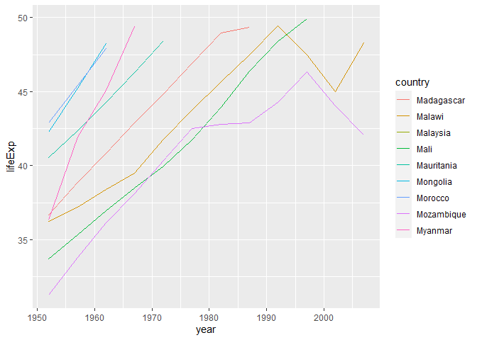

W6: Practicing functions
================
Peter Thramkrongart

\#\#disclaimer: I did not include any loops in this assignment, as I
think loops are dumb, hard to read, and are often much slower than
vectorized functions

Define a defensive function that calculates the Gross Domestic Product
of a nation from the data available in the gapminder dataset. Using that
function, calculate the GDP of Denmark in the following years: 1967,
1977, 1987, 1997, 2007, and 2017.

``` r
#load Packages
pacman::p_load(pacman,tidyverse,gapminder)

#make dataset visible
gapminder<- gapminder::gapminder

#define function
#it makes sure the data is in the right format and returns the same dataframe with with a new column called "gdp"
gdpFunc<- function(gapminder){
  gapminder$gdp <- as.numeric(as.character(gapminder$pop))*
    as.numeric(as.character(gapminder$gdpPercap))
  return((gapminder))
}

gapminder<- gapminder %>% gdpFunc()#uss function
years <- c(1967,1977,1987,1997,2007,2017)#make list of years
gapminder %>% filter(year %in% years & country == "Denmark" )#show only the relevant examples
```

    ## # A tibble: 5 x 7
    ##   country continent  year lifeExp     pop gdpPercap           gdp
    ##   <fct>   <fct>     <int>   <dbl>   <int>     <dbl>         <dbl>
    ## 1 Denmark Europe     1967    73.0 4838800    15937.  77116977700.
    ## 2 Denmark Europe     1977    74.7 5088419    20423. 103920280028.
    ## 3 Denmark Europe     1987    74.8 5127024    25116. 128771236166.
    ## 4 Denmark Europe     1997    76.1 5283663    29804. 157476118456.
    ## 5 Denmark Europe     2007    78.3 5468120    35278. 192906627081.

Write a script that loops over each country in the gapminder dataset,
tests whether the country starts with a ‘B’ , and print out whether the
life expectancy is smaller than 50, between 50 and 70, or greater than
70.

``` r
#Here is use the dplyr::case_when() function that makes it possiple to chain if-statemens
#it checks all conditional combinations
#I save it as a new column in the gapminder dataset
gapminder$test <- case_when(
  str_detect(gapminder$country, "^B") == T &
    gapminder$lifeExp < 50 ~ "Starts with B and gdp per capita is smaller than 50",
  str_detect(gapminder$country, "^B") == T &
    gapminder$lifeExp > 50 &
    gapminder$lifeExp < 70  ~ "Starts with B and gdp per capita is between 50 and 70",
  str_detect(gapminder$country, "^B") == T &
    gapminder$lifeExp > 70  ~ "Starts with B and gdp per capita is larger than 70",
  gapminder$lifeExp < 50 ~ "Does not start with B and gdp per capita is smaller than 50",
  gapminder$lifeExp > 50 &
    gapminder$lifeExp < 70 ~ "Does not start with B and gdp per capita is between 50 and 70",
  gapminder$lifeExp > 70 ~ "Does not start with B and gdp per capita is larger than 70"
)


#I don't want to print all rows, so I'll just show that it went well, be only showing the unique outcomes of countries that start with A or B
gapminder %>% filter(str_detect(gapminder$country, "^B") == T |str_detect(gapminder$country, "^A") == T) %>% .$test %>% unique()
```

    ## [1] "Does not start with B and gdp per capita is smaller than 50"  
    ## [2] "Does not start with B and gdp per capita is between 50 and 70"
    ## [3] "Does not start with B and gdp per capita is larger than 70"   
    ## [4] "Starts with B and gdp per capita is between 50 and 70"        
    ## [5] "Starts with B and gdp per capita is larger than 70"           
    ## [6] "Starts with B and gdp per capita is smaller than 50"

Write a script that loops over each country in the gapminder dataset,
tests whether the country starts with a ‘M’ and graphs life expectancy
against time (using plot() function) as a line graph if the mean life
expectancy is under 50 years.

``` r
#I chose to just plot all the countries that fitted the conditions in a single plot
#notice that some countries outgrow the visualization as their life expectancy grow over 50 years

gapminder %>% filter(str_detect(.$country, "^M" ) & lifeExp < 50) %>%
  ggplot(aes(year, lifeExp, color = country))+ geom_line()
```

<!-- -->
